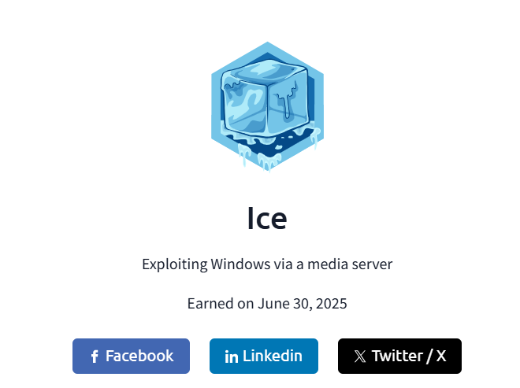

  

<i>🏅 TryHackMe ICE Room - Completed by Rishi Bose</i>

---

# 🧊 TryHackMe ICE Room – Full Exploitation Walkthrough

> **Author:** Rishi Bose | Cybersecurity Enthusiast  
> **Platform:** [TryHackMe – ICE Room](https://tryhackme.com/room/ice)

---

## 📋 Overview

This repository documents the full step-by-step compromise of the TryHackMe *ICE* machine. It includes:

- ✅ Reconnaissance using Nmap  
- ✅ CVE research and Metasploit exploitation  
- ✅ Privilege Escalation to SYSTEM  
- ✅ Looting credentials using Mimikatz  
- ✅ Post-exploitation actions and persistence  
- ✅ Extra credit: Golden ticket, timestomp, and more

---

## 📄 Report

Download the full professional write-up:  
📄 [ICE_Room_Report_Rishi_Bose.docx](./ICE_Room_Rishi_Bose.pdf)

---

## 🛠️ Tools Used

- `nmap`
- `metasploit-framework`
- `mimikatz (kiwi)`
- `hashdump`, `screenshare`, `record_mic`, `timestomp`
- Golden ticket creation & RDP persistence

---

## 🔥 Skills Practiced

- Windows exploitation  
- Local privilege escalation  
- Credential dumping  
- Post-exploitation techniques  
- Red team methodology

---

## 🧠 Credits

Made with 💻 by [Rishi Bose](https://www.linkedin.com/in/rishibose08)  
#CyberOnTop #THM #RedTeam #OSCPPrep #TryHackMeBadge

